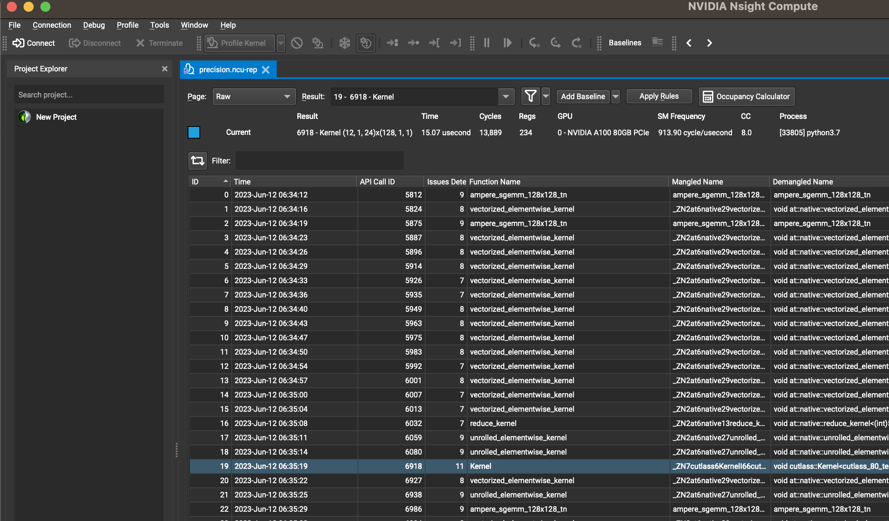

## Verify precision loss for `torch.matmul` and `baddbmm`

### Run
```Python
python3 verify_torch_precision.py
```

### Profiling using nsight-compute
Note first change `ncu` and `python` to your path.
```shell
sudo bash run.sh
```
I have also provided a ncu profiling result file `precision.ncu-rep`.

Switch to `raw` page, it's easy to konw ID `0`, `2`, `19`, `22`, `99` and `101`
correspond to the six GEMM in our code.

Select the corresponding ID and switch to `Source` paper.

#### For version 1
we can find the ID `0` and `2` that use float32 only use CUDA core(As there is no `MMA` instruction in the GPU's assembly code).

### For version 2
For ID `19`, there are `MMA` instructions like `HMMA.16816.F32 R4, R132, R136, R4`,
which indicates this kernel uses tensor core for computation.
For ID `22`, there are only `FMMA` instruction like `FFMA R46, R89, R107, R46`,
which indicates this kernel only uses cuda core.

### For version 3
For ID `99` and `101`, there are `MMA` instrcution like `HMMA.1688.F32.TF32 R4, R132, R136, R4`, which indicates both of them use tensor core.

### Solution
Simply add `torch.backends.cuda.matmul.allow_tf32 = True` to use TF32 for GEMM to avoid precision loss.
